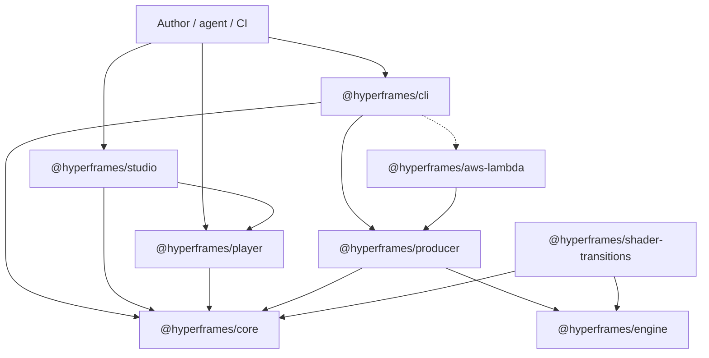
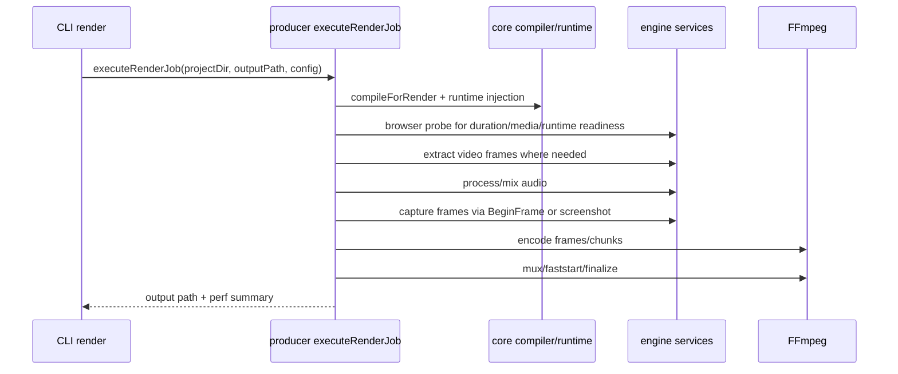
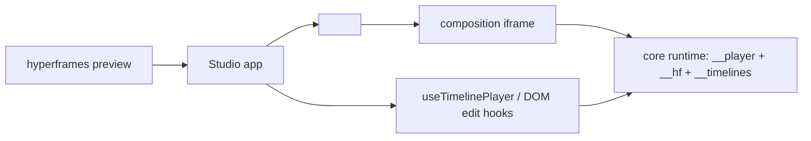

# 01-architecture-overview

> Current baseline: HyperFrames v0.6.61 (`a5f3b5b2`). The architecture is now
> eight packages plus registry/docs/skills content. The core invariant is still
> HTML source + deterministic `window.__hf.seek(time)`; the major new axis is
> distributed rendering via `@hyperframes/producer/distributed` and
> `@hyperframes/aws-lambda`.

## 1. Package dependency graph



The important boundary is not "React vs non-React"; it is "page contract vs host
driver":

- The composition page owns visual state and exposes seekable time.
- Hosts drive the page: player/studio for preview, producer/engine for render,
  Lambda workers for distributed chunks.
- `core` is the shared language: HTML schema, timing, runtime, variables, linter,
  registry item types.

## 2. Package map into notes

| Note | Package/system | Source entrypoints |
|---|---|---|
| 02 | `core` types, parser, compiler-facing helpers, linter, registry | `packages/core/src/index.ts`, `packages/core/src/core.types.ts` |
| 03 | `core` runtime and deterministic adapters | `packages/core/src/runtime/init.ts`, `packages/core/src/runtime/adapters/` |
| 04 | `engine` browser capture and FFmpeg services | `packages/engine/src/index.ts`, `packages/engine/src/services/frameCapture.ts` |
| 05 | `producer` local staged pipeline | `packages/producer/src/services/renderOrchestrator.ts`, `packages/producer/src/services/render/stages/` |
| 06 | `cli` command orchestration | `packages/cli/src/cli.ts`, `packages/cli/src/help.ts`, `packages/cli/src/commands/` |
| 07 | player + Studio playback bridge | `packages/player/src/hyperframes-player.ts`, `packages/studio/src/player/` |
| 08 | shader transitions | `packages/shader-transitions/src/hyper-shader.ts`, `packages/engine/src/utils/shaderTransitions.ts` |
| 09 | Studio app/file/editing shell | `packages/studio/src/App.tsx`, `packages/studio/src/hooks/`, `packages/studio/src/components/editor/` |
| 10 | captions, picker, manual editing | `packages/studio/src/captions/`, `packages/studio/src/hooks/useDomEditSession.ts` |
| 11 | distributed render + Lambda adapter | `packages/producer/src/distributed.ts`, `packages/aws-lambda/src/index.ts` |
| 12 | variables/templates | `packages/core/src/runtime/getVariables.ts`, `packages/core/src/runtime/validateVariables.ts` |
| 13 | skills/catalog/docs/MCP | `skills/`, `registry/`, `docs/guides/mcp.mdx` |

## 3. Local render call trace

`hyperframes render` eventually calls the producer's in-process orchestrator.
The current renderer is no longer best understood as one giant function; it is a
sequencer over stage modules.



Current producer stages:

1. `compileStage` - compile HTML, write compiled artifacts, choose screenshot vs
   BeginFrame, resolve `deviceScaleFactor`.
2. `probeStage` - launch a browser, discover dynamic duration/media, reconcile
   compiled metadata.
3. `extractVideosStage` - extract source video frames for deterministic injection.
4. `audioStage` - extract and mix audio.
5. `captureStage`, `captureStreamingStage`, or `captureHdrStage` - capture pixels.
6. `encodeStage` - encode frame files or streaming input.
7. `assembleStage` - mux audio, faststart, finalize container.

The perf summary still groups some sub-stages under broader names, but reading
the stage modules is now the clean way to understand behavior.

## 4. Distributed render call trace

Distributed rendering isolates the render into pure filesystem primitives. This
lets AWS Lambda, K8s Jobs, Temporal, or any other scheduler provide transport
without owning rendering logic.

```text
Controller:
  plan(projectDir, config, planDir)
    -> compiled/index.html
    -> extracted video frames
    -> audio.aac
    -> meta/composition.json
    -> meta/encoder.json
    -> meta/chunks.json
    -> plan.json + planHash

Worker N:
  renderChunk(planDir, chunkIndex, output)
    -> deterministic capture for [startFrame, endFrame)
    -> encoded chunk or PNG frame directory

Controller:
  assemble(planDir, orderedChunkPaths, audioPath, outputPath)
    -> final mp4 / webm / mov / png-sequence output
```

`@hyperframes/aws-lambda` wraps this with Step Functions, S3, a Lambda handler,
an SDK, and a CDK construct. See [11-aws-lambda-distributed.md](11-aws-lambda-distributed.md).

## 5. Preview and Studio path

Preview uses the same runtime contract, but the host is interactive instead of a
frame-by-frame capture process.



The Studio does not treat the player as an opaque video tag. It reaches into the
same-origin iframe for:

- `window.__player` when the runtime is installed.
- `window.__timelines` as a direct-timeline fallback.
- DOM inspection for timeline discovery and manual editing.
- Caption and picker/manual-edit bridges.

## 6. Deterministic contract

The minimum render contract:

```ts
window.__hf = {
  duration: number,
  seek(timeSeconds: number): void,
  media?: HfMediaElement[],
  transitions?: HfTransitionMeta[],
}
```

Key companion globals:

| Global | Owner | Consumers |
|---|---|---|
| `window.__HF_VIRTUAL_TIME__` | producer file server | runtime, page scripts |
| `window.__player` | core runtime | player, Studio, producer bridge |
| `window.__timelines` | user/runtime/compiled HTML | runtime, player, Studio |
| `window.__hyperframes` | core runtime | composition scripts |
| `window.__hfVariables` | engine/producer before page script | `getVariables()` |
| `window.__hfVariablesByComp` | compiler/runtime scoping | sub-composition scripts |
| `window.__hfTypegpuTime` | TypeGPU adapter | WebGPU render loops |
| `window.__HF_PICKER_API` | picker runtime | Studio/manual edit UI |

## 7. Two regimes

| Concern | Render mode | Preview/Studio mode |
|---|---|---|
| Time | Host calls `__hf.seek(t)` for every frame | Player/Studio calls `seek`, `play`, `pause` |
| Clock | Virtualized Date/performance/timers/rAF | Real browser clock |
| Pixels | BeginFrame or screenshot capture | Browser display |
| Media | Pre-extracted/injected, then mixed | Native elements and runtime sync |
| Errors | fail-fast render diagnostics | console/UI toasts |
| Parallelism | local workers or distributed chunks | single interactive document |

## 8. Remotion comparison

| Remotion | HyperFrames |
|---|---|
| React composition source | HTML document source |
| `useCurrentFrame()` | runtime seek contract + library adapters |
| React Player | vanilla `<hyperframes-player>` custom element |
| Remotion Lambda | `producer/distributed` + `@hyperframes/aws-lambda` |
| component-driven editing | DOM/source/manual editing over HTML |
| `inputProps` | composition variables + `--variables` / Lambda variables |

## 9. What changed since the first notes

- Package count grew from seven to eight with `@hyperframes/aws-lambda`.
- CLI root command count is now 29, including `lambda`, `cloud`, and `auth`.
- Producer is staged and reusable by distributed rendering.
- Variables are first-class: declaration, runtime read, validation, CLI overrides,
  and Lambda batch rendering.
- Runtime adapters include TypeGPU/WebGPU time dispatch.
- Linter modules expanded to include fonts and textures.
- Studio has been split into smaller hooks/components; `App.tsx` is no longer the
  only place to understand editing.
- Public docs now cover MCP, website-to-video, Lambda templates, HDR, 4K, and
  catalog workflows in much more detail.

## 10. Next steps

Read [02-core-types-parsers.md](02-core-types-parsers.md) next. It defines the
types and runtime helpers that every other package assumes.
