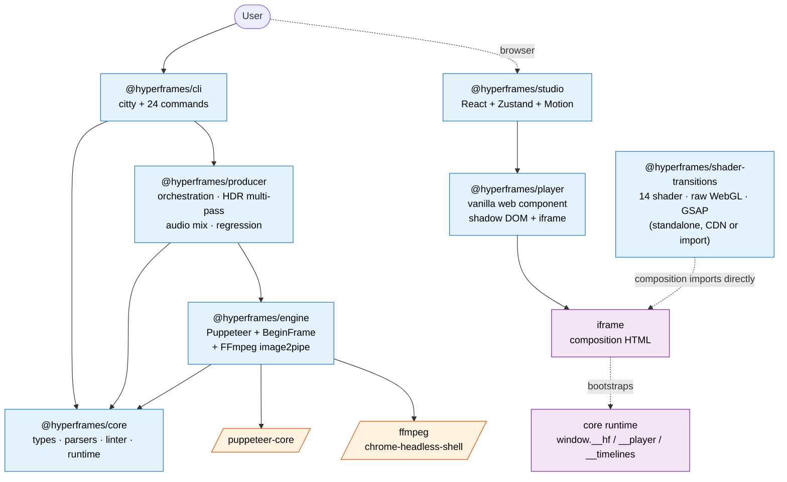
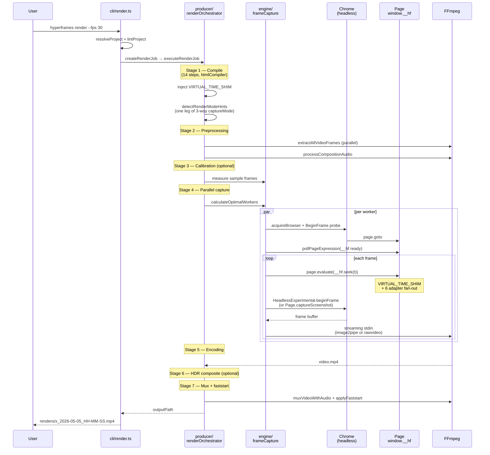
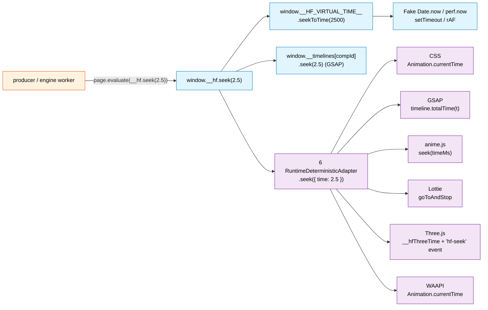

# 01-architecture-overview

> One-line summary: Hyperframes is a deterministic video system built around **HTML pages + the `window.__hf.seek()` contract**, where engine (capture), producer (orchestration), and player/studio (interactive) all share one contract.

---

## 1. Package dependency graph



**Text fallback (no Mermaid)**:

```
User → cli → core / producer → engine → puppeteer / ffmpeg
User → browser → studio → player → iframe
                                          ↓ (runtime bootstrap)
                                       core runtime (window.__hf, etc.)
shader-transitions: composition imports it directly (no package dependency edge)
```

Key observations:
- **`cli` is a thin orchestration layer** — each command lazy-loads producer/engine via dynamic `import()`.
- **`producer` mostly *re-exports* `engine`** — `producer/services/frameCapture.ts:1-21` is a shim that re-exports engine capture helpers. Producer’s real value is compile/meta/HDR multipass/regression *orchestration*, not capture itself.
- **`player` / `studio` do not import `core` directly** — they are *controllers* over the iframe runtime contract (`window.__hf`, `__player`).
- **`shader-transitions` is standalone** (raw WebGL + GSAP) with no dependency on other Hyperframes packages. Engine connects only through metadata (`__hf.transitions`).

---

## 2. Map into notes

| Note | Area | First file to open |
|---|---|---|
| 02 | core types / parsers / generators / linter | `packages/core/src/index.ts` (192 lines, export catalog) |
| 03 | core runtime + frame adapters | `packages/core/src/runtime/init.ts` (2000+ lines) |
| 04 | engine capture pipeline | `packages/engine/src/services/frameCapture.ts` |
| 05 | producer orchestration | `packages/producer/src/services/renderOrchestrator.ts` |
| 06 | CLI command system | `packages/cli/src/cli.ts` (124 lines) |
| 07 | studio + player UI layer | `packages/player/src/hyperframes-player.ts` (~40KB single file) |
| 08 | shader-transitions WebGL | `packages/shader-transitions/src/hyper-shader.ts` |

---

## 3. `hyperframes render` call trace

The central command: end-to-end from CLI until FFmpeg receives frames.

```
$ hyperframes render --fps 30 --quality high --format mp4

  packages/cli/src/cli.ts:53      citty dispatches the `render` subcommand
                                  (lazy import via dynamic import())
  ↓
  packages/cli/src/commands/render.ts:128
    ├─ resolveProject(dir)        validate index.html, composition.json
    ├─ lintProject()              core.lintHyperframeHtml() (strict can block)
    ├─ loadProducer()             dynamic import('@hyperframes/producer')
    ├─ createRenderJob({fps,quality,format,workers,hdrMode})
    └─ executeRenderJob(job, projectDir, outPath, onProgress)
  ↓
  packages/producer/src/services/renderOrchestrator.ts
    │
    │ Stage 1: Preprocessing
    ├─ compileForRender(html)              core generators + VIRTUAL_TIME_SHIM inject
    ├─ extractAllVideoFrames()             FFmpeg extracts frames from video src (parallel)
    │   └─ extractionCache check           .hyperframes/cache/extraction/{hash}/
    ├─ HDR preflight (if HDR media found)  WebGPU readback probe
    ├─ VFR preflight (variable frame rate) keyframe interval analysis
    ├─ processCompositionAudio()           extract audio elems → atrim+adelay+amix
    │
    │ Stage 2: Parallel frame capture
    ├─ calculateOptimalWorkers()           CPU / memory / frame count constraints
    ├─ executeParallelCapture()            one Chrome per worker
    │   └─ each worker:
    │       packages/engine/src/services/frameCapture.ts
    │         createCaptureSession()       acquireBrowser() — BeginFrame probe
    │         initializeSession()          warmup beginFrame loop (while page loads)
    │         for frame in [start..end]:
    │           prepareFrameForCapture(frameIdx, time)
    │             quantizeTimeToFrame(time, fps)
    │             page.evaluate(() => window.__hf.seek(t))   ← contract
    │               └─ fileServer.ts VIRTUAL_TIME_SHIM updates
    │                  fake Date.now / perf.now / timers / rAF
    │           captureFrameCore(frameIdx, time)
    │             if BeginFrame mode:
    │               client.send("HeadlessExperimental.beginFrame",
    │                 { frameTimeTicks, interval, screenshot:{format,quality} })
    │               → atomic layout-paint-composite + one screenshot
    │             else (screenshot fallback):
    │               page.captureScreenshot()
    │           [streaming] writeFrame(buf) → ffmpeg stdin
    │
    │ Stage 3: Encoding
    ├─ chunked encode (very large) OR streamingEncoder.ts (typical)
    │   spawn ffmpeg -f image2pipe -vcodec mjpeg -i - ... -c:v h264 -crf 18 out.mp4
    │   FrameReorderBuffer reorders out-of-order worker frames into ordered stdin
    │   - HDR: -f rawvideo -pix_fmt rgb48le, HEVC + smpte2084
    │
    │ Stage 4: HDR composite (HDR mode only)
    ├─ pass 1: SDR Chrome screenshots (DOM layer)
    ├─ pass 2: WebGPU readback (HDR video layer, float16 PQ/HLG)
    └─ blitRgba8OverRgb48le() per frame → ffmpeg rawvideo
    │
    │ Stage 5: Mux + faststart
    ├─ muxVideoWithAudio(video.mp4, audio.aac, final.mp4)
    └─ applyFaststart() — move moov atom to front
  ↓
  renders/<name>_YYYY-MM-DD_HH-MM-SS.mp4
```

Five anchors (each note dives deeper):

1. **VIRTUAL_TIME_SHIM** (`packages/producer/src/services/fileServer.ts:95-190`) — fakes `Date.now()`, `requestAnimationFrame`, etc., so the page believes wall time is N seconds. → note 05
2. **`window.__hf.seek()` contract** (`packages/engine/src/types.ts:68-77`) — the single deterministic time surface the page must implement. → note 03
3. **BeginFrame probe + branch** (`packages/engine/src/services/browserManager.ts:115-137`) — availability varies by chrome-headless-shell build; probe once then fall back. → note 04
4. **FrameReorderBuffer** (`packages/engine/src/services/streamingEncoder.ts:45-95`) — parallel workers produce out-of-order frames; encoder stdin must be sequential → `waitForFrame(N)` barrier. → note 04
5. **Adaptive worker sizing** (`packages/engine/src/services/parallelCoordinator.ts:71-150`) — CPU/memory/total-frame constraints + extra throttle via `captureCostMultiplier` on large jobs. → note 04

---

## 4. `hyperframes preview` call trace

Interactive mode (not `render`). Three launch modes are chosen automatically.

```
$ hyperframes preview <dir>

  packages/cli/src/commands/preview.ts:120
    ├─ lintProject() (warnings only — not blocking)
    ├─ if isDevMode():     spawn(pnpm studio) — monorepo dev Vite
    ├─ elif hasLocalStudio: spawn vite from project node_modules — @hyperframes/studio installed
    └─ else:               embedded preview server (engine + static files, port 3002+)
  ↓
  Vite dev server starts (or embedded server)
    symlink project dir into studio data dir
    open http://localhost:<port>/#project/<name>
  ↓
  Browser loads studio
    packages/studio/src/components/nle/NLELayout.tsx:66
      ├─ Preview (top): <Player> ─→ <hyperframes-player>
      │   packages/player/src/hyperframes-player.ts (vanilla web component)
      │     ├─ shadow DOM + iframe
      │     ├─ iframe.src = composition HTML URL
      │     └─ after iframe load: probe loop (setInterval)
      │         wait for window.__hf, __player, __timelines
      │   packages/studio/src/player/hooks/useTimelinePlayer.ts
      │     iframe.contentWindow.__player.seek(t) ← sync direct call (same-origin)
      │     read iframe.contentWindow.__clipManifest → sync React state
      └─ Timeline (bottom): clip tracks, scrubber, zoom
          state: usePlayerStore (Zustand) + liveTime pub-sub (60 Hz outside React)
```

Key observations:
- **Studio does not treat player as a black box** — it reads/controls globals on `iframe.contentWindow` directly for responsiveness.
- **Player audio fallback** (`hyperframes-player.ts:69-99`): on iOS, autoplay inside the iframe may fail — player mirrors `<audio>` in the parent while the iframe stays muted but time-advances. Once switched, it sticks for the session.
- **Three entry modes**: dev (monorepo contributor), local (app depends on studio via npm), embedded (default user with no local studio). Details → note 06.

---

## 4.5 `render` sequence diagram



## 5. Deterministic contract — `window.*` namespace

The **only interface** between the composition page and hosts. This *is* Hyperframes.

| Object | Defined by | Consumed by | Role |
|---|---|---|---|
| `window.__hf` | page (or core runtime) | engine, producer, player | `{ duration, seek(t), media?, transitions? }` — deterministic time |
| `window.__HF_VIRTUAL_TIME__` | producer fileServer (injected) | core runtime (indirectly) | Fake `Date` / `perf` / timers / `rAF` — virtual timeline |
| `window.__player` | core runtime (`runtime/init.ts`) | studio, player | 43-method PlayerAPI compat — interactive control (many edit methods no-op) |
| `window.__timelines` | composition (or core generator) | studio (scrub), runtime adapters | `{ [compositionId]: gsap.timeline() }` — GSAP registry |
| `window.__hyperframes` | core runtime entry | composition | `{ fitTextFontSize() }` — text measurement |
| `window.__hfAnime` / `__hfLottie` / `__hfThreeTime` | composition / user | matching runtime adapter | auto-discovery hooks |
| `window.__clipManifest` / `__playerReady` / `__renderReady` | core runtime | studio, player, producer harness | timeline cache + readiness |
| `window.__HF_PICKER_API` | core runtime picker | studio or external host | element picker imperative API |

One-shot data flow:



**Core idea**: one `__hf.seek(t)` call **fans out three ways**:
1. VIRTUAL_TIME_SHIM (virtual clock)
2. direct GSAP timeline seek
3. sequential `seek({time})` on six `RuntimeDeterministicAdapter`s (CSS / GSAP / anime / Lottie / three / WAAPI)

All synchronous paths — right after the call the page pixels match time *t*. That is the determinism guarantee.

---

## 6. Frame adapter pattern — the load-bearing abstraction

`packages/core/src/adapters/types.ts:1-15`:

```ts
export interface FrameAdapter {
  id: string;
  init?(ctx: FrameAdapterContext): Promise<void> | void;
  getDurationFrames(): number;
  seekFrame(frame: number): Promise<void> | void;
  destroy?(): Promise<void> | void;
}

export interface FrameAdapterContext {
  compositionId: string;
  fps: number;
  width: number;
  height: number;
  rootElement?: HTMLElement;
}
```

Small public interface — but **there is no automatic runtime registration hook** for `FrameAdapter` today. To fan new libraries into preview/render you usually add an internal `RuntimeDeterministicAdapter` (see note 03).

Existing six runtime adapters live in `packages/core/src/runtime/adapters/`:
- `gsap.ts` — `timeline.pause().seek(time)`
- `css.ts` — `Element.getAnimations()` + `animation.currentTime`
- `animejs.ts` — `anime.timeline().seek()`
- `lottie.ts` — lottie-web + dotlottie
- `three.ts` — exposes time only (`window.__hfThreeTime`); composition listens
- `waapi.ts` — Web Animations API directly
- `lottieReadiness.ts` — wait-for-load helper

The GSAP reference (`packages/core/src/adapters/gsap.ts`, 44 lines) is the smallest template for a new adapter.

→ Deeper: note 03 + `cheatsheets/01-frame-adapter.md`

---

## 7. Two regimes

Always ask: **is this code for deterministic render or interactive preview?**

| Aspect | Deterministic (engine/producer) | Interactive (player/studio) |
|---|---|---|
| Time source | VIRTUAL_TIME_SHIM (fake) | real `requestAnimationFrame` |
| Advance | external `__hf.seek(t)` | `__player.play()` + internal rAF loop |
| Pixels | `HeadlessExperimental.beginFrame` or `Page.captureScreenshot` | live DOM |
| Audio | rebuilt in FFmpeg (atrim/adelay/amix) | iframe `<audio>` or parent proxy |
| Parallelism | N workers split frames | single browser tab |
| Adapter `seekFrame` | called directly | indirectly via `__player.seek()` |
| `shader-transitions` | engine mode skips WebGL (metadata only) | GSAP + WebGL runs normally |

`shader-transitions` branches on `__HF_VIRTUAL_TIME__` (`hyper-shader.ts:175-177`) — in engine mode it skips the WebGL loop and lets engine composite from metadata.

---

## 8. Remotion vs Hyperframes (summary)

| Remotion | Hyperframes | Essence |
|---|---|---|
| React component = composition | HTML + data attrs = composition | agents already speak HTML |
| `useCurrentFrame()` (React context) | `window.__hf.seek()` (page global) | framework-agnostic |
| Remotion Studio (React tree) | Hyperframes Studio (React at iframe boundary) | iframe makes compositions “normal pages” |
| Lambda render farm | local workers + Docker | simpler infra, OSS-friendly |
| `delayRender()` / `continueRender()` | `pollPageExpression(__hf)` | page signals readiness |
| BeginFrame (Remotion-inspired) | `HeadlessExperimental.beginFrame` (direct) | attribution in engine |
| image2pipe streaming | `streamingEncoder.ts` | same idea + reorder buffer |

See `engine/streamingEncoder.ts:3-6` for the Remotion-inspired attribution comment.

---

## 8.5 Skills directory — AI agent integration

`$HYPERFRAMES_REPO/skills/` — 12 skills (~13k lines incl. markdown/scripts/templates). **Orthogonal to this lab**: skills teach *how to use* Hyperframes; the lab analyzes *how it works*. Still useful cross-reference for PoC track B.

### 12-skill catalog

| skill | One line |
|---|---|
| `hyperframes` | Core composition authoring — SKILL.md + `references/` + `templates/` + `palettes/` + `scripts/` (largest) |
| `hyperframes-cli` | CLI usage (init / preview / render / lint / publish) |
| `hyperframes-registry` | `add` / `catalog` (GitHub conventions fetch — see note 02 §8) |
| `gsap` | GSAP timelines — follows note 02 SUPPORTED_PROPS/EASES allowlists |
| `tailwind` | Tailwind v4 browser-runtime patterns (differs from Studio v3 — see CLAUDE.md) |
| `animejs` | anime.js v4+ `.seek()` + `__hfAnime` global |
| `css-animations` | CSS `@keyframes` + `data-start` local timelines |
| `lottie` | lottie-web + dotlottie-web + `__hfLottie` registration |
| `three` | Three.js + `__hfThreeTime` + `hf-seek` event |
| `waapi` | Web Animations API |
| `remotion-to-hyperframes` | **8-step migration + SSIM validation corpus T1–T4** |
| `website-to-hyperframes` | **7-step capture pipeline** — brand → script → storyboard → TTS/transcript → build → review |

### Typical skill layout

```
<skill>/
  SKILL.md            ← ~300–500 lines: preamble + workflow steps
  references/         ← deep-dive guides
  assets/             ← fixtures, screenshots, reference code
  scripts/            ← one-off helpers
  templates/          ← (hyperframes) starter code
  palettes/           ← (hyperframes) color palettes
```

### Install flow

```bash
npx skills add heygen-com/hyperframes
# → clones into ~/.skills/heygen-com/hyperframes/
# → indexed by Claude Code / Cursor / Codex
```

CLI entry: `packages/cli/src/commands/skills.ts` — thin wrapper around `npx skills add`.

### Relationship to this lab

```
Hyperframes user  ←(skills teach)→  AI agent
         ↓
   writes composition HTML
         ↓
        ⊥
Hyperframes internals  ←(lab analyzes)→  learner
```

**Why skills are shallow here**: skills are the outside-in guardrail (“do / don’t”). Internals (“why”) belong in lab notes.

### Suggested cross-reference for PoC track B

- **PoC 01**: read `skills/remotion-to-hyperframes/` — same pattern: apply deterministic time contract to an external library.
- **PoC 02**: `skills/hyperframes/references/transitions/` (if present) — how users *consume* transitions before you add a shader.

`remotion-to-hyperframes` SSIM checks resemble this lab’s PoC bar (e.g. PSNR 38 dB).

## 9. Related notes

This note is the **entry** — everything branches from here.

| Topic | Note |
|---|---|
| Types / parsers / linter / HTML generators | [02](02-core-types-parsers.md) |
| six RuntimeDeterministicAdapters + PlayerAPI bootstrap | [03](03-core-runtime-adapters.md) |
| BeginFrame probe / FrameReorderBuffer / parallelCoordinator | [04](04-engine-capture.md) |
| VIRTUAL_TIME_SHIM / five-stage pipeline / HDR / regression | [05](05-producer-pipeline.md) |
| citty + lazy load / 24 commands / three preview modes | [06](06-cli-orchestration.md) |
| `<hyperframes-player>` + audio proxy / Studio + iframe | [07](07-studio-player.md) |
| 14 shaders + two-mode init (15 in engine composite) | [08](08-shader-transitions.md) |
| `window.*` devtools snippets | [cheatsheet 02](cheatsheets/02-runtime-contract.md) |
| Seven steps for a new adapter | [cheatsheet 01](cheatsheets/01-frame-adapter.md) |
| Chrome flags / GPU encoder | [cheatsheet 03](cheatsheets/03-render-flags.md) |
| Docker baseline / PSNR / audio correlation | [cheatsheet 04](cheatsheets/04-regression-testing.md) |

## 10. Next steps

1. **Read notes 02+ in order** — core deep, then engine/producer.
2. **`projects/01-frame-adapter-poc/`** — implement an adapter for a library you like; confirm deterministic render.
3. **devtools** — after `npx hyperframes preview <project>`:
   ```js
   document.querySelector('hyperframes-player').iframeElement.contentWindow.__hf.duration
   document.querySelector('hyperframes-player').iframeElement.contentWindow.__player.seek(1.5)
   document.querySelector('hyperframes-player').iframeElement.contentWindow.__timelines
   ```
4. **`bun run --cwd packages/producer test:regression`** — run regression once and read PSNR output (needs Docker image; see CLAUDE.md).
